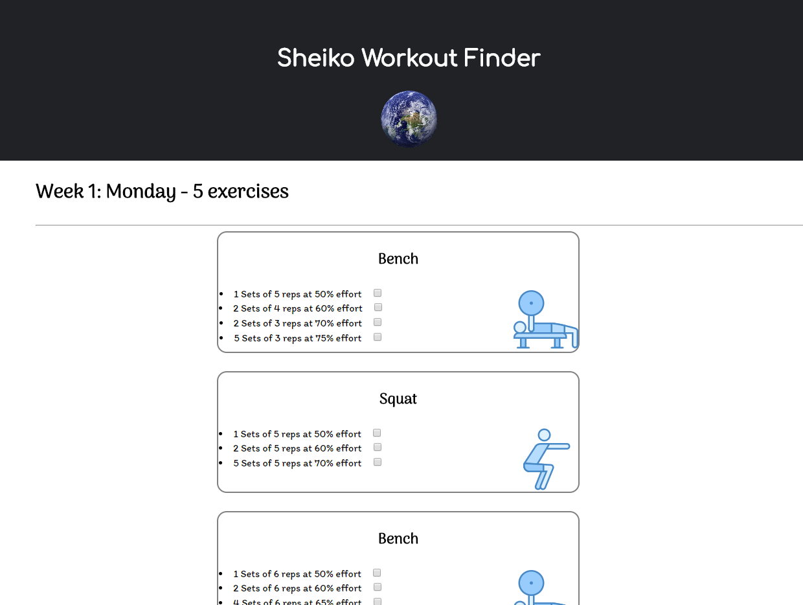

## Sheiko

Boris Sheiko is a Russian powerlifting coach renown for his very effective weightlifting programs.
The many programs he has created, all named "Sheiko" with a number appended at the end, can come across as daunting and confusing.
This website aims to aid users in finding the specific Sheiko variation that suits them based on the criteria they enter.

## Current functionality

Below is an example of what the site looks like in its early stage.
The Sheiko 37 program is being used as default.

The site currently displays the chronologically exhaustive list of exercises to perform, delimited by the day on which they should be performed.
Every exercise is contained within a rounded box which displays a bulleted list of every set and repetition that should be performed with a specified effort as the percentage of a onerep-max.
Furthermore, a picture of the exercise is displayed on the right of the bulleted list is used to complement it.

