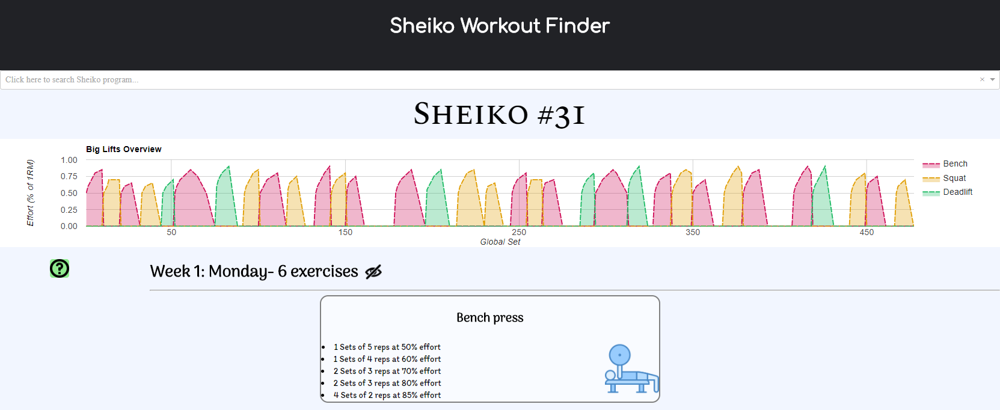

## Sheiko

Boris Sheiko is a Russian powerlifting coach renown for his very effective weightlifting programs.
The many programs he has created, all named "Sheiko" with a number appended at the end, can come across as daunting and confusing.
This website aims to aid users in finding the specific Sheiko variation that suits them based on the criteria they enter.

## Current functionality

The site is split into 2 portions: a survey followed by an exercise listing.

Upon accessing the website for the first time, the user is prompted with a 3-question survey.
These questions are then used to direct the user to a program best suited for them.

The user, however, is still free to view other Sheiko programs.

Below is an example of the first question of the three-question survey.

The exercises are displayed as a chronologically exhaustive list, delimited by the day on which they should be performed.
Every exercise is contained within a rounded box which displays a bulleted list of every set and repetition that should be performed with a specified effort as the percentage of a one-rep-max.
Furthermore, a picture of the exercise is displayed on the right of the bulleted list is used to complement it.
Clicking on an exercise, will have it slide to the left, giving space to Google Analytics, which will be used as an aid in the visualization of the data.

